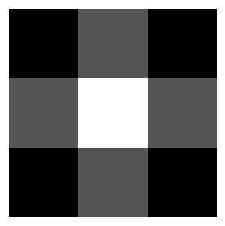

# Image Processing - Lane Detection

# Assignee Info

**Course**: Advanced Image Processing (66205), HIT 2024 \
**Lecturer**: [Dr. Dmitry Goldstein](https://www.hit.ac.il/en/faculty_staff/Dimitry_Goldstein) \
**Assignees**: Stas Susha, Idan Gabai

# Abstract

Lane detection is a critical component in the development of autonomous driving and advanced driver-assistance systems (ADAS). This work provides an investigation analysis and comparison of different lane detection and tracking methods. We examine traditional image processing techniques (non-machine learning) that weve learned in the class, such as Canny Edge Detection, Hough Transform, Gaussian Blur, image grayscale, alongside additional approaches – ROI (region of interest) definition, sliding window, polynomial curve fitting, bird-eye view, etc.

# Introduction

Lane detection plays an important role in ensuring vehicle safety and navigation accuracy. In recent years, there has been significant advancement in lane detection methods, involving computer vision techniques and machine learning algorithms [[1]](#ref-1). The detection have to be processed in real-time to prevent accidents by providing immediate feedback to the driver or vehichle system. Modern driver assistance systems are using advanced sensors such as cameras, LiDAR, radars to collect and combine the data, which can enhance the reliability of the lane detection.

As part of the work preparation we have recorded 2 videos - 2min daylight and 1min 21sec (full recordings are 21min 52sec daylight and 7min 37sec at night) in 4K resolution using a cell phone camera.
To shorten the image processing time we resized the video to 720p (1280x720 pixes). We used these 2 videos as a baseline for our image processing approaches.

In our project we examine 2 ways for lane detection and tracking utilizing traditional image processing methods (without machine learning).

1. Approach 1 - [Hough Transform](#1-hough-transform) - basic approach with edge detection and hough transform experiments
2. Approach 2 - [Polynomial Curve Fit](#2-polynomial-curve-fit) - fitting quadratic (2nd-degree) a second-degree polynomial to the detected lane line points

<div style="display: flex; justify-content: space-between; margin-left: auto; margin-right: auto; width: 70%">
<div style="text-align: center; margin-right: 10px;">
    <p>Daylight</p>
    
  </div>
<div style="text-align: center;" >
    <p>Night</p>
    
  </div>
</div>

# Installation

1. Install Anaconda on your machine  - [link](https://www.anaconda.com/download)
2. Create Python 3 (we used 3.12.4) virtual environment
   ``python -m venv venv``
3. Activate environment:

* Windows:
  ``.\venv\Scripts\activate``
* macOS/Linux:
  ``source venv/bin/activate``

4. Install requirements
   ``pip install -r requirements.txt``

# Project Navigation

| File                            | Description                                                                             |
| ------------------------------- | --------------------------------------------------------------------------------------- |
| ``src/lane_detection_a1.ipynb`` | straigh lane lines detection using Hough Transform                                      |
| ``src/lane_detection_a2.ipynb`` | curved lane lines detection using polynomial fitting                                    |
| ``tools/image_processing.py``   | image processing functions: <br>-Edge detection: Canny, Laplace, Sobel X/Y<br>-Image smoothing: Gaussian, Median<br>-Color conversion<br>-Thresholding<br>-Dilation<br>-Normalization|
| ``tools/utils.py``              | **BaseUtils class** - plot images, save frame, display (x, y) coordinates on image, etc.<br>**VidProc class** - video operations: display, resize, write to file|
| ``videos``                      | directory contains input and output/processed video files                               |
| ``images``                      | directory contains images for README documentation and intermediate video frames/images |
|                                 |                                                                                         |

# 1. Hough Transform

## 1.1. Overview

This method includes the basic approach for lane detection which involves the usage of the tools learned in the class, such as Sobel, Laplacian, Canny edge detection, Gaussain blur for image smoothing and  Hough Tansform for lines recognition.
We examine different algorithms for edge detection and noise reduction and choose which ones worked best for us. \
In addition we will define the whole pipeline (see 1.2. Pipeline) - the procedure (sequence of functions) to be applied to the image in order to detect and visualize the roadway lane lines [[14]](#ref-14). \
The goal is to run the pipeline in real-time on the videos (daylight and night) we have created and produce the output video with the marked left and right lane lines. \

## 1.2. Pipeline

<!--
1. Read video frames
2. Convert frame to grayscale
3. Noise reduction and smoothing (Gaussian blur)
4. Apply edge detection (Canny)
5. Define ROI
6. Apply Hough Line Transform
7. Analyze line slope and intercept - to define lane boundries
8. Lane lines overlay - draw lane lines on top of the original image
9. Output video -->


### 1.2.1 Read video frames

Read the video file and prepare the video frames for further processing. The frames processed one-by-one similar to a single image processing.

### 1.2.2 Convert frame to gray scale

The input image (a) is in RGB format, each pixel represented by 3 colors (Red, Green, Blue).
The output image (b) is in grayscale, means that it has only one channel, each pixel has intesity of light ranging from black (0) to white (255).

Why do we use the grayscale conversion?

- **Simplicity** - gray-scale image requires less computation resources to process compared to RGB
- **Feature extraction** - edge detection algorithms such as Canny require gray-scale image in the input because it relies on intesity gradient, which will be used to detetermine if the pixel belongs to the edge or not
  based on the threshold.

Q: How OpenCV converts the RGB to gray?
A: Grayscale value is equal to the weighted sum of the RGB values. The weights are choosen by human perception [[2]](#ref-2).
$Gray = 0.299 \times R + 0.587 \times G + 0.114 \times B$

<div style="text-align: center; margin-right: 10px; margin-left: auto; margin-right: auto; width: 70%">
    <p>Input image (RGB) to GRAY</p>
    
</div>

### 1.2.3 Image smoothing

Image smoothign algorithm applied for:

- **Noise reduction** - video recorded from the phone camera can cotain noise due to sensor issues, lightning camera or even environment noise.
  In terms of edge detection that will be done later, noise can create false edges and affect the accuracy of true edge detection.
- **Details reduction** - helps to reduce the amount of detail in the image, focusing on more significant structures and edges.

Q: Why to use smoothing?
A: Smoothing the image can be important when applying edge detection algorithms like Canny that relies on on calculating the gradient of the image to find areas with high intensity changes.
  Noise can cause large variations in gradient, resulting in false edges detection. Smoothing the image helps to create more stable gradient field.
  In other words smoothing can reduce the false positives and enhace true edges detection, by averaging out the noise.

The image smoothing done by applying the convolution on the image with a filter kernel [[3]](#ref-3)[[4]](#ref-4).

We tested the most common smooting methods.

#### Averaging

The method simply takes the average of all the pixels under the kernel area and replaces the central element.
This smoothing helps connect dashed lane markers to form a near continuous line.
Example of 3x3 averaging filter:

$$
K_{3,3} = \frac{1}{9}
\begin{bmatrix}
1 & 1 & 1 \\
1 & 1 & 1 \\
1 & 1 & 1 
\end{bmatrix}
$$

#### Gausian blur

Applies Gaussian blur (convolution of Gaussian kernel) to the image, smoother blur compared to averaging.
Intended to remove the noise that approximately follows the Gaussian distribution.
Can be used to remove the noise caused by the rain, snow and dirty roads.

Gausian function in 2-dimension (x and y directions):

$$
G(x, y) = \frac{1}{2\pi\sigma^{2}}e^{-\frac{(x^{2}+y^{2})}{2\sigma^{2}}}
$$

Example of Gaussian filter 3x3:

$$
K_{3,3} = \frac{1}{16}
\begin{bmatrix}
1 & 2 & 1 \\
2 & 4 & 2 \\
1 & 2 & 1 
\end{bmatrix}
$$

Using OpenCV we can easily create 3x3 2D Gaussian kernel in python:

```{python}
import cv2
import numpy as np

ksize, sigma = 3, 0  # kernel size and standard deviation
gaussian_kernel = cv2.getGaussianKernel(ksize, sigma=sigma) # get the Gaussian kernel
gaussian_kernel_2d = gaussian_kernel @ gaussian_kernel.T * 16 # convert the kernel to a 2D matrix

print(f"3x3 Gaussian kernel:\n{gaussian_kernel_2d} x 1/16")
plt.figure(figsize=(3, 3))
plt.imshow(gaussian_kernel_2d, cmap='gray')
plt.axis('off')
plt.show()
```

output

```
3x3 Gaussian kernel:
[[1. 2. 1.]
 [2. 4. 2.]
 [1. 2. 1.]] x 1/16
```



#### Median blur

Applies median blur to the image, by replaces each pixel's value with the median value of the neighboring pixels.
Effective for removing salt-and-pepper noise.

Example:

1. Original window 3x3 (need to use odd window size) $
   \begin{bmatrix}
   12 & 4 & 7 \\
   3 & 5 & 8 \\
   6 & 9 & 2
   \end{bmatrix}
   $
2. Sort window values [2, 3, 4, 5, 6, 7, 8, 9, 12]
3. Take median value which is 6 in our case (middle value in sorted array)
4. Reaplce central pixel (5) with median value (6). Result
   $
   \begin{bmatrix}
   12 & 4 & 7 \\
   3 & 6 & 8 \\
   6 & 9 & 2
   \end{bmatrix}
   $

#### Smoothing results on different kernel sizes

<div style="text-align: center; margin-right: 10px;">
    
</div>

<span style='color:#b4a0ff'>NOTE</span>: in further steps we choosed to use Canny algorithm for edge detection, part of Canny edde detection multi-step procedure it requies to convert image to gray scale and execute Gaussian smoothing. \
Though we decided to use Gaussian as a smoothing method with kernel sizes 7x7 or 11x11.

### 1.2.4 Edge detection

Edge detection algortihms such as **Sobel** and **Canny** are frequently used in lane detectoin tasks.

- **Highlighting lane boundries** - identify sharp changes in intensity related to the edges of lane markings, helps to distinguish the lanes from the rest of the road
- **Enhancing features** - edge detection enhances the important features of the lane lines, which makes them easier for tracking [[5]](#ref-5)
- **Further processing** - detected edges can be used as the input for line detection algorithms such as Hough Transform

#### Sobel edge detection

**Sobel edge detection** based on **Sobel operator** developed in 1968 by Sobel and Feldman, researchers in digital image processing from Stanford University. [[6]](#ref-6)
It works by calculating the gradient of the image intensity at each pixel, which helps in highlighting regions with high spatial frequency that correspond to edges.

* Gradient calculation
  Sobel operator uses 3x3 convolution kernels, one for Gx (horizontal) and one for Gy (vertical) directions.
  These kernels are convolved with the image to approximate the derivatives;
  * Horizontal Kernel (Gx):

$$
\begin{bmatrix}
+1 & 0 & -1 \\
+2 & 0 & -2 \\
+1 & 0 & -1 
\end{bmatrix}
$$

* Vertical Kernel (Gy):

$$
\begin{bmatrix}
+1 & +2 & +1 \\
0 & 0 & 0 \\
-1 & -2 & -1 
\end{bmatrix}
$$

* Convolution - kernels are applied to the image to compute the gradient in x and y directions. The gradients highlight the intensity changes in the respective directions.
* Gradient magnitude:

$$
G = \sqrt{G^2_x + G^2_y}
$$

* Gradient direction:

$$
\theta= arctan(\frac{G_y}{G_x})
$$

#### Canny edge detection

**Canny edge detection** is more robust and flexible algorithm developed by John F. Canny, Ph.D. in electrical engineering. [[6]](#ref-6) The Canny edge detection algorithm is a multistage process that helps to identify the edges in an image by reducing noise and preserving important edge features. [[7]](#ref-7)[[8]](#ref-8)

1. **Grayscale conversion** - convert image to grayscale
2. **Noise reduction** using Gaussian blur:

$$
G(x, y) = \frac{1}{2\pi\sigma^{2}}e^{-\frac{(x^{2}+y^{2})}{2\sigma^{2}}}
$$

3. **Gradient calculation** using Sobel kernel

$$
G = \sqrt{G^2_x + G^2_y}
$$

$$
\theta= arctan(\frac{G_y}{G_x})
$$

4. **Non-Maximum Suppression** - remove spurious response to edge detection by suppressing all the gradient values to zero except the local maxima \
   
5. **Hysteresis thresholding** - two thresholds (high and low) are applied to determine potential edges. Strong edges are those above the high threshold, and weak edges are those between the high and low thresholds.\
   

#### Laplacian edge detection

**Laplacian edge detection** as other edge detection algorithms used to identify edges in an image by detecting regions of rapid intensity change [[10]](#ref-10).

1. **2nd order deriviative** - the Laplacian operator is a second-order derivative operator. While first-order derivatives (like the Sobel operator) detect edges by looking for maximum gradient values, the Laplacian detects edges by finding zero-crossings in the second derivative of the image intensity.
2. **Mathematical representation** - see below, wehre f(x, y) is the image intensity function:

$$
L(x, y) = \frac{\partial^2 f(x, y)}{\partial x^2} + \frac{\partial^2 f(x, y)}{\partial y^2}
$$

3. Kernel convolution - the Laplacian operator applied using a convolution kernel.
   For example 3x3 kernel:

$$
\begin{bmatrix}
0 & 1 & 0 \\
1 & -4 & 1 \\
0 & 1 & 0
\end{bmatrix}
$$

4. **Noise sensitivity** - The Laplacian operator is sensitive to noise because it uses second-order derivatives, which can amplify noise.
   To mitigate this, the image is often smoothed using a Gaussian filter before applying the Laplacian.
   This combination is known as the Laplacian of Gaussian (LoG) filter.
5. **Zero crossing** - Edges are detected by finding zero-crossings in the Laplacian-filtered image.
   These zero-crossings correspond to points where the intensity changes rapidly, indicating an edge.

#### Edge detection experiments and best result method

<div style="text-align: center; margin: 10px;">
    <p>Edge detection experiments</p>
    
</div>

Best results were obtained with Canny algorithm:

<div style="text-align: left;">
  
</div>

### 1.2.5 Define ROI (Region of Interest)

The polygonal **ROI (region of interest)** is part of the image we want to focus on.
It's important to define the ROI, which can improve the computational time.
Instead of processing the whole image we are concetrating only on specific part of the image where road lanes are likely to be.

<div style="text-align: left;">
  
</div>

### 1.2.6 Hough Line Transform

By converting image space into parameter space, the Hough Transform facilitates robust line detection, making it well-suited for identifying lane markings on roads [[11]](#ref-11)
We utilize Probabilistic Hough Line Transform algortihm within a manually defined ROI (region of interest) to detect the lane markings.
Unlike the standard Hough Transform, which considers all points in the image, the probabilistic version randomly selects a subset of points, making it faster and more efficient. [[12]](#ref-12)
Fine tuning parameters like minimum line length and maximum gap between segements can improve the accuracy.
In further steps lines detected by Hough Transform will be analyzed for slope and intercetion in order to distinguish between left and right lines.

How it works?

1. **Edge Detection** - find edges using edge detection algorithm such as Canny (we did in previos step)
2. **Random Sampling** - A subset of edge points is randomly selected (reduced the computation time)
3. **Line fitting** - For each selected point, the algorithm tries to fit lines by considering pairs of points and calculating the line parameters (slope and intercept or polar coordinates) [[12]](#ref-12) For each selected point $(x_0, y_0)$, we can define the family of lines that goes through that point
   $$
   r_{\theta} = x_0 \cdot cos \theta + y_0 \cdot sin \theta $$ 

   Meaning that each pair $(r_\theta, \theta)$ represents each line that passes by $(x_0,y_0)$
   $$
4. **Iteration** This process is repeated multiple times to ensure that lines are detected accurately
5. **Parameters fine tuning**:

* rho: Distance resolution of the accumulator in pixels.
* theta: Angle resolution of the accumulator in radians.
* threshold: Minimum number of intersections to detect a line.
* minLineLength: Minimum length of a line. Line segments shorter than this are rejected.
* maxLineGap: Maximum allowed gap between points on the same line to link them

<div style="text-align: left; margin: 10px;">
    <p>Probabilistic Hough Line Transform result</p>
    
</div>

### 1.2.7 Analyze and detect lane lines

After lines were detected in the ROI, we can classify them into left/right lane lines by analyzing the slope.
Slope calculation: $(y_2 - y_1) / (x_2 - x_1)$

**Lines classification**:

- Left lane lines: typically have a negative slope (downwards from left to right)
- Right lane lines: typically have a positive slope (upwards from left to right)

**Filter**:

- Filter out lines that don't meet a certain slope threshold to remove noise. For example - slope threshold 0.5:
  - left lines filtered by slope < -0.5
  - right lines filtered by slope > +0.5

**Detect dominant lines**:

Process the remaining lines to get a single representative line for each lane line left and right.
- **longest line** - find the longest ling among the filtered lines on the left and right sides
- **average line** - average left and right lines start and end points coordinates
- **least squares** - find the dominant line start and end points using the least squares method
   - Apply least squares:
      - extract start and the end poitns from the left and right lines
      - cobmine the extracted points into the single array
      - use least squares method to fit the line to these points, by solving the $y=mx + c$, where $m$ is the slope and $c$ is the intercept. \
      The least square solution minimizes the sum of squared differences between the input values and the values predicted by the line.
      ```    
      A = np.vstack([all_points[:, 0], np.ones(len(all_points))]).T
      m, c = np.linalg.lstsq(A, all_points[:, 1], rcond=None)[0]
      ```
   - Retrieve predicted line coordinates
      - find min and max x-values from the combined array of points - this will define the range of the line
      - calculate y-values by using the slope $m$ and intercept $c$ values retrieved from the least squares fitting
      ```
      x_1 = np.min(all_points[:, 0])
      x_2 = np.max(all_points[:, 0])
      y_1 = m * x_start + c
      y_2 = m * x_end + c
      regression_line = np.array([x_1, y_1, x_2, y_2])
      ```
<span style='color:#4daafc; font-weight: bold'>Example</span>: \
   Given input lines `np.array([[[0, 1, 4, 9]], [[0, 2, 3, 11]], [[0, 0.5, 3.5, 6.5]]])`  \
   Observation: 
   - for most of the cases we will prefer either average or the line retrieved from the least squares. \
   We are looking for the lane line which can be represented as a bulk of lines, close to each other, retrieved from the Hough Transform. 
   - longest line can be an outlier (in the left sub-plot solid orange & dashed red lines). In such a case need to choose carefully the ROI (region of interest)
<div style="text-align: center; margin: 10px;">
    <p>Applying different methods to find the representative line</p>
    
</div>

**Apply on video frames**:
- Yellow lines - filtered left and right lane lines by slope threshold
- Red lines - representative lines detected using different methods
<div style="text-align: center; margin: 10px;">
    <p>Finding Representative lines using different methods</p>
    
</div>

### 1.2.8 Draw lane lines on top of the original image

**Find intersection**:
  - Create reference horizontal lines in the top and bottom of the ROI area
  - Find the intersection of the filtered domninant left and right lines
  - Draw the lines on top of the image

<div style="text-align: center; margin: 10px;">
    <p>Find intersection with horizontal lines and draw lane lines</p>
    
</div>

**Moving average smoothing **
  - We apply the moving average smoothing on N samples using the formula \
    $\text{moving average(x)} = (\text{current average}) - \frac{\text{(current average)}}{N} + \frac{x}{N}$ \
    where $x$ is the new sample of line coordinates and $N$ is number of samples over which the average is calculated
    - $\text{current average}/ N $ - subtracting the influence of the oldest sample
    - $\text{x}/ N$ - adding the influence of the new sample
    - higher N value means smoother average, less sensetive to short term changes
    - lower N value - more responsive average, more sensetive to recent changes 

Q: Why to use smoothing moving average in lane line detection? \
A: Benefits:
1. **Noise reduction** - Video frames can contain a lot of noise due to varying lighting conditions, shadows, and other environmental factors. A moving average helps to smooth out these fluctuations, making the detected lane lines more consistent
2. **Stability Over Time** - Lane lines can appear jittery or unstable from frame to frame due to minor variations in detection. By averaging the detected lane positions over several frames, the moving average provides a more stable and reliable representation of the lane lines
3. **Handling Occlusions** - Temporary occlusions (like passing vehicles or pedestrians) can disrupt lane detection. Smoothing helps to maintain the continuity of lane lines even when they are partially obscured
4. **Improved accuracy** - By reducing the impact of outliers and transient errors, the moving average can improve the overall accuracy of lane detection, ensuring that the detected lanes are more closely aligned with the actual road markings

**Observation**: \
Below you can see the affect of N samples on which the moving average is calculated.
- Low N=1 is sensetive to short-term outliers
- Medium N value between 10 to 20 is well balanced - good stability and not oversmoozed
- High N value results in over-smoothing, too much influence of the old results which affects the in-time line detection.

<div style="text-align: center; margin: 10px;">
    <p>Moving average smoothing based on different number of samples</p>
    
</div>


## 1.3. Summary

We have recorded videos for experiments during the daylight and at night.
As part of the work we examined different methods for image smoothing, edge detection and lane line filtering.
In most of the video frames we were able to detect the straight lines successfully using calibrated Canny edge detection and Probabilistic Hough Line Transform.

**Advantages**:
- Simplicity - relatively simple to implement and understand
- Efficency - very effective in computation, provides real time video processing
- Noise robustnsess - Canny edge detection able to detect the edges even in non-optimal noisy images
- Shows good results in clear road condition where marking are clear and well defined

**Disadvantages**:
- ROI manually defined - in case the road will go up and down, the manully defined region of interest will be not effective
- Lmited to straight lines - Hough Trasform designed to detect straight lines, and less suitable for cuved road lanes.
- Sensetivity to lightning condition - lightning condition like shadow or faded markings can affect the accuracy of lane detection. \
  For example - when the road is under construction the lane markings have orange faded color (like in our daylight video), in this case additional processing is required, \
  it can be parameter tunning in Canny edge detection or thresholding, dilation to enhance the white color.

This approach serves as good baseline but requires improvements. 
In 2nd approach we'll try to answer/handle some of the disadvantages, such as polynomial fitting for curved lines and \
threhsholding for white color enhancement, in order to enhance the accuracy of the lane lines detection.

# 2. Polynomial Curve Fit

## 2.1. Overview

This method approaches lane detection numerically. We process the region of interest (ROI) and apply polynomial fitting [[16]](#ref-16) to the left and right lane lines.
Additionaly, we outline the entire pipeline (see 2.2. Pipeline) - the sequence of functions used to detect and visualize the roadway lane lines.
Our goal is to address the the limitations from previous appraoch - process curved road lanes and apply threshold filter to create black & white image to highlight the road markings.
Finally, we apply the created pipeline to both daylight and night videos and produce the output vide with the marked lane lines.

## 2.2. Pipeline


### 2.2.1 Read video frames

Read the video file and prepare the video frames for further processing. The frames processed one-by-one similar to a single image processing.

### 2.2.2 Apply Perspective Transformation - Bird Eye View

We apply a bird's eye perspective transformation to simplify the processing of the region of interest (ROI). This transformation involves mapping the original image to a top-down view, which helps in accurately identifying and analyzing the lane lines. By doing this, we can better isolate the lane lines from other elements in the frame, making subsequent processing steps more efficient and reliable. [[15]](#ref-15)

<div style="text-align: left;">
  
</div>

### 2.2.3 Filter the frame to binary image

Filtering the frame to a binary image involves several stages to enhance the features of interest:

1. Color Transformation - We transform the three color channels (usually RGB) to a different color space (such as HLS or HSV) to better highlight the lane lines. This step helps in distinguishing the lane lines from the rest of the road surface.

<div style="text-align: left;">
  
</div>

2. Normalization - When occur this process adjusts the intensity values of the image to a common scale, improving the contrast and making the lane lines more prominent.
3. Thresholding -  We apply a threshold to convert the image into a binary format, where the lane lines are represented by white pixels (value 1) and the rest of the image by black pixels (value 0). This step simplifies the image, making it easier to detect the lane lines.

<div style="text-align: left;">
  
</div>

### 2.2.4 Summarize the binary image columns into a histogram

In this step, we summarize the binary image by creating a histogram of the pixel values along the columns. This histogram represents the distribution of white pixels (lane lines) across the width of the image. Peaks in the histogram indicate the positions of the lane lines, which helps in identifying their locations.

<div style="text-align: left;">
  
</div>

### 2.2.5 Extract expected left and right lane lines

Using the histogram data, we can extract the positions of the left and right lane lines. This involves identifying the peaks in the histogram that correspond to the lane lines. After finding these expected locations, we use a sliding window approach to extract the lane lines from limited size regions. The sliding window method involves placing a window around the initial peak position and then moving it vertically along the lane line. At each step, the window is adjusted to follow the lane line by centering it on the highest concentration of white pixels within the window. This process is repeated for both the left and right lane lines, ensuring accurate and continuous extraction of the lane lines throughout the image.

### 2.2.6 Do a polinomial fitting to the left lane line and the right lane line

Once the expected lane lines are extracted, we fit a second-degree polynomial curve to each lane line. This involves using a quadratic function to approximate the shape of the lane lines. In this case, the y-axis is constant, and we are looking for the matching x location at each lane line. Polynomial fitting helps in smoothing out any irregularities and provides a continuous representation of the lane lines, which is crucial for accurate lane detection.

### 2.2.7 Draw lane on the image

Finally, we draw the detected lane lines back onto the original image. This step involves mapping the polynomial curves of the lane lines from the bird’s eye view back to the original perspective. By overlaying the lane lines on the original image, we can visualize the detected lanes, providing a clear and intuitive representation of the lane boundaries.

<div style="text-align: left;">
  
</div>

### 2.3. Discussion

We see some short commings in this method

1. *High Computation*: Processing 720x1080 video requires significant computing power. While reducing the resolution is an obvious solution, further optimizations could be explored.
2. *Invisible Lane Lines*: During lane changes or when passing intersections, lane lines may not be visible.
3. *Steep Curves*: The method fails to detect one of the lane lines on steep curves. Adjusting the Region of Interest (ROI) might resolve this issue.

### 2.4. Summary

<div style="text-align: left;">
  
</div>

While the polynomial curve fit is working pretty well depending on the binary image input, we have managed to provide a nice driving assistant, similar to a very basic cruise control. However, we are still far from achieving autonomous driving as we lack a model that can interpret images with logic and make decisions.

# References
<a id="ref-1"></a>
1. Lane Detection Methods Survey for Automatic Driving. Mingyue Yang 2023, Journal of Physics ([link](https://iopscience.iop.org/article/10.1088/1742-6596/2547/1/012015))
<a id="ref-2"></a>
2. Color conversions. OpenCV - ([link](https://docs.opencv.org/3.4/de/d25/imgproc_color_conversions.html#:~:text=The%20conversion%20from%20a%20RGB,bwsrc%2C%20cv%3A%3ACOLOR_RGB2GRAY))
<a id="ref-3"></a>
3. Smoothing images. OpenCV - ([link](https://docs.opencv.org/4.x/d4/d13/tutorial_py_filtering.html))
<a id="ref-4"></a>
4. Preprocessing Methods of Lane Detection and Tracking for Autonomous Driving. \
   Akram Heidarizadeh. Apr 2021, College of Eng., University of Tehran ([link](https://arxiv.org/pdf/2104.04755))
<a id="ref-5"></a>
5. Lane Line Detection and Object Scene Segmentation Using Otsu Thresholding and the Fast Hough Transform for Intelligent Vehicles in Complex Road Conditions ([link](https://www.mdpi.com/2079-9292/12/5/1079)) \
21 February 2023. Muhammad Awais Javeed,M uhammad Arslan Ghaffar, Muhammad Awais Ashraf,Nimra Zubair, Ahmed Sayed M. Metwally,Elsayed M. Tag-Eldin, Patrizia Bocchetta, Muhammad Sufyan Javed, Xingfang Jiang 8.
<a id="ref-6"></a>
6. Edge Detection: from Sobel to Canny. Salvi Elisa, Dec 28, 2022. Medium article ([link](https://medium.com/@salvi.elisa/edge-detection-from-sobel-to-canny-efd6c04fbe9c))
<a id="ref-7"></a>
7. What is Canny edge detection? Educative web article ([link](https://www.educative.io/answers/what-is-canny-edge-detection))
<a id="ref-8"></a>
8. Canny Edge Detection. OpenCV- ([link](https://docs.opencv.org/4.x/da/d22/tutorial_py_canny.html))
<a id="ref-9"></a>
9. Exploring Edge Detection in Python: 2- Sobel Edge Detector: A Closer Look ([link](https://medium.com/@erhan_arslan/exploring-edge-detection-in-python-2-sobel-edge-detector-a-closer-look-de051a7b56df)) \
   Erhan Arslan, Nov 11, 2023. Medium article
<a id="ref-10"></a>
10. How to Detect Edges using Laplacian 2nd Order Derivative in Python using OpenCV ([link](https://towardsdev.com/how-to-detect-edges-using-laplacian-2nd-order-derivative-in-python-using-opencv-easy-project-e6e9cfde42e8)) \
    Abhishek Sharma, Feb 13, 2022. Medium article
<a id="ref-11"></a>
11. Lane Detection Methodologies for Autonomous Driving Systems: A Comprehensive Review with a Focus on the Hough Transform ([link](https://towardsdev.com/how-to-detect-edges-using-laplacian-2nd-order-derivative-in-python-using-opencv-easy-project-e6e9cfde42e8)) \
Kalva Mahendhar Yadav, Ramineni Padmasree, Bhukya RajkumarFeb, et. al International Journal of Engineering Research and Applications. May 2024.
<a id="ref-12"></a>
12. Probabilistic Hough Transform for Line Detection. AJLearn web article ([link](https://ajlearn.net/opencv_hough_lines_probabilistic))
<a id="ref-13"></a>
13. Hough Line Transform. OpenCV - ([link](https://docs.opencv.org/3.4/d9/db0/tutorial_hough_lines.html))
<a id="ref-14"></a>
14. Detecting Lanes with OpenCV and Testing on Indian Roads ([link](https://medium.com/computer-car/my-lane-detection-project-for-the-self-driving-car-nanodegree-by-udacity-36a230553bd3#.nsiuks2pk)) \
    Param Aggarwal, Dec 7, 2016. Medium article
<a id="ref-15"></a>
15. Perspective Transformation. TheAILearner - ([link](https://theailearner.com/tag/cv2-getperspectivetransform/))
<a id="ref-16"></a>
16. Advanced-Lane-Lines. TheAILearner - ([link](https://github.com/Dt-Pham/Advanced-Lane-Lines))
